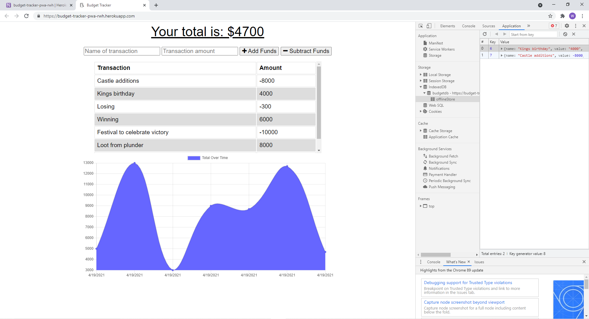

# BudgetTrackerRWH

This app will allow users to enter income and payments as transactions in a budget tracker. The user can then use a chart to visualize the data. When offline, the app will store the user's entries in the IndexedDB and will upload to the database upon coming back online. The app remains functional offline.

## Deployed App Homepage/offline

## License
  ​
This project is licensed under the Unlicensed license.
  
## Questions
  ​
If you have any questions about the repo, open an issue or contact me directly at BigRonald42@hotmail.com. You can find more of my work at [GitHub](https://github.com/BiggRonn/).

## Link to Deployed App
https://budget-tracker-pwa-rwh.herokuapp.com/

## Resources 
https://developers.google.com/web/fundamentals/instant-and-offline/offline-cookbook#cache-falling-back-to-network